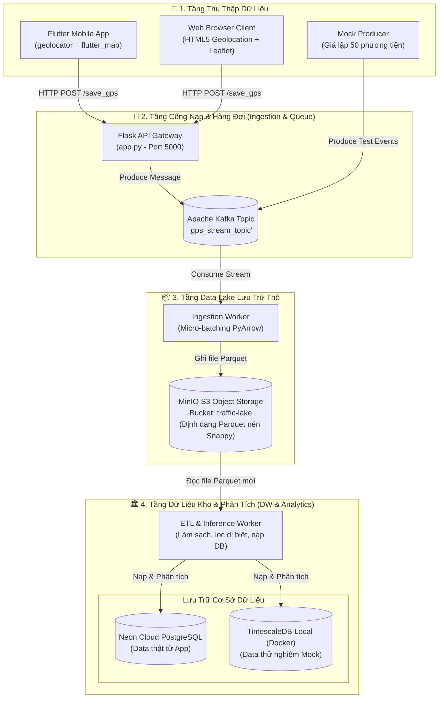
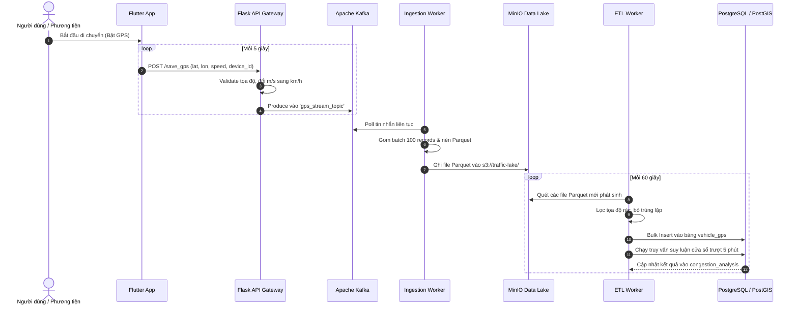

# 🚦 TRAFFIC ANALYSIS — HỆ THỐNG PHÂN TÍCH ẢNH HƯỞNG CỦA ĐÈN GIAO THÔNG DỰA TRÊN DỮ LIỆU KHÔNG - THỜI GIAN

[](https://flutter.dev/)
[](https://python.org/)
[](https://kafka.apache.org/)
[](https://min.io/)
[](https://www.postgresql.org/)
[](https://postgis.net/)
[](https://www.docker.com/)

> **Đề tài Nghiên cứu Khoa học**: *Nghiên cứu ứng dụng dữ liệu không gian - thời gian (Spatio-Temporal Data) nhằm phân tích và đánh giá ảnh hưởng của chu kỳ đèn tín hiệu giao thông đến tình trạng ùn tắc cục bộ trên các tuyến đường đô thị trọng điểm.*

---

## 📑 Mục lục
1. [Bối cảnh & Ý tưởng Đề tài](#-bối-cảnh--ý-tưởng-đề-tài)
2. [Mục tiêu Nghiên cứu](#-mục-tiêu-nghiên-cứu)
3. [Kiến trúc Toàn diện Hệ thống](#-kiến-trúc-toàn-diện-hệ-thống)
4. [Hệ sinh thái Công nghệ](#-hệ-sinh-thái-công-nghệ)
5. [Mô hình Dữ liệu Không - Thời gian](#-mô-hình-dữ-liệu-không---thời-gian)
6. [Thuật toán & Chỉ số Đánh giá Ùn tắc](#-thuật-toán--chỉ-số-đánh-giá-ùn-tắc)
7. [Cấu trúc Thư mục Dự án](#-cấu-trúc-thư-mục-dự-án)
8. [Hướng dẫn Cài đặt & Khởi chạy](#-hướng-dẫn-cài-đặt--khởi-chạy)
9. [Định hướng Phát triển Tiếp theo](#-định-hướng-phát-triển-tiếp-theo)

---

## 💡 Bối cảnh & Ý tưởng Đề tài

Ùn tắc giao thông đô thị là một trong những thách thức nghiêm trọng nhất tại các thành phố lớn như Hà Nội và TP. Hồ Chí Minh. Một trong những nguyên nhân trực tiếp dẫn tới hiện tượng ùn ứ cục bộ là **sự thiếu đồng bộ và cứng nhắc của hệ thống đèn tín hiệu giao thông**. 

Hiện nay, đa số các cụm đèn tín hiệu tại Việt Nam vẫn vận hành theo **chu kỳ tĩnh cố định (Fixed-time Control)** hoặc cài đặt đơn giản theo vài khung giờ trong ngày mà không phản ánh kịp thời mật độ phương tiện thực tế.

**Ý tưởng cốt lõi của đề tài:**
* Khai thác luồng dữ liệu vết di chuyển GPS độ chính xác cao từ thiết bị di động cá nhân của người tham gia giao thông.
* Kết hợp không gian địa lý (GIS) của các nút giao thông với chiều thời gian thực tế để tính toán vận tốc lưu thông và chiều dài hàng đợi.
* Đối chiếu lưu lượng xe thực tế với lịch trình pha đèn tĩnh (`light_schedule`), từ đó phát hiện tự động các điểm đèn đang hoạt động **kém hiệu quả (`is_inefficient`)**, hỗ trợ các nhà quản lý đô thị có cơ sở dữ liệu xác thực để điều chỉnh chu kỳ đèn tối ưu.
* **Khu vực thực nghiệm:** Tuyến đường huyết mạch Phạm Văn Đồng, Hà Nội (các ngã tư trọng điểm: *Xuân Đỉnh, Cổ Nhuế, Hoàng Quốc Việt, Mai Dịch*).

---

## 🎯 Mục tiêu Nghiên cứu

1. **Thu thập dữ liệu di động (Mobile Ingestion):** Xây dựng ứng dụng di động đa nền tảng (Flutter) thu thập GPS chu kỳ ngắn kèm vận tốc và độ chính xác.
2. **Xây dựng Data Pipeline phân tán (Lakehouse Architecture):** Thiết kế pipeline tiếp nhận dữ liệu thời gian thực có khả năng mở rộng (Scalable), sử dụng Apache Kafka làm bộ đệm streaming, Apache Parquet trên MinIO S3 làm Data Lake lưu trữ lâu dài.
3. **Mô hình hóa Cơ sở dữ liệu Không - Thời gian (Spatio-Temporal DW):** Ứng dụng PostgreSQL cùng tiện ích mở rộng PostGIS, thiết kế bảng phân vùng (Partitioning theo tháng) để lưu trữ hàng triệu điểm GPS hiệu năng cao.
4. **Suy luận & Phát hiện bất cập chu kỳ đèn:** Xây dựng thuật toán phân tích cửa sổ trượt (Sliding Window) 5 phút để xác định mức độ ùn tắc và tự động gắn cờ cảnh báo chu kỳ đèn không tương thích lưu lượng xe.

---

## 🏛️ Kiến trúc Toàn diện Hệ thống

Hệ thống được thiết kế theo mô hình phân lớp Data Lakehouse kết hợp Streaming Ingestion:



### 🔄 Luồng Vận Hành Dữ Liệu (Sequence Flow)



---

## 🛠️ Hệ sinh thái Công nghệ

| Phân hệ | Công nghệ | Phiên bản / Chi tiết | Vai trò |
|---|---|---|---|
| **Client / Mobile** | **Flutter / Dart** | SDK ^3.9.2 | Ứng dụng di động thu thập GPS nền, vẽ bản đồ tuyến đường thực tế. |
| **Bản đồ Mobile** | **flutter_map & latlong2** | 6.1.0 / 0.9.1 | Hiển thị nền bản đồ OpenStreetMap miễn phí không cần API key. |
| **API Gateway** | **Python / Flask** | 3.0.0 | Tiếp nhận REST API, xác thực dữ liệu và chuyển tiếp vào Message Broker. |
| **Message Broker** | **Apache Kafka** | Confluent 7.5.0 | Hàng đợi sự kiện phân tán, đệm tải và xử lý streaming bất đồng bộ. |
| **Data Lake** | **MinIO S3** | Latest | Kho lưu trữ đối tượng tương thích chuẩn AWS S3. |
| **Định dạng Lưu trữ** | **Apache Parquet** | PyArrow 14.0.1 | Lưu trữ dữ liệu dạng cột (Columnar), nén Snappy tối ưu dung lượng và tốc độ truy vấn. |
| **Data Warehouse** | **TimescaleDB / Postgres** | PG 15 | Cơ sở dữ liệu phân tích chuỗi thời gian, bảng phân vùng và quản lý không gian. |
| **Spatial Engine** | **PostGIS** | 3.x | Xử lý hình học không gian (Geometry Point 4326), tính toán tọa độ nút giao. |
| **Cloud Database** | **Neon Tech** | Serverless PG | Lưu trữ dữ liệu thực tế thu thập từ thiết bị di động trên hạ tầng đám mây. |
| **Containerization** | **Docker & Compose** | v2.x | Đóng gói toàn bộ hạ tầng Kafka, MinIO, Postgres vận hành nhất quán. |

---

## 🗄️ Mô hình Dữ liệu Không - Thời gian

Lược đồ cơ sở dữ liệu được định nghĩa đồng bộ trong [`unified_schema.sql`](file:///C:/Users/MINH/.gemini/antigravity/scratch/Traffic_Analysis/traffic_analysis/unified_schema.sql) gồm 6 thực thể nòng cốt:

```
┌────────────────────┐          ┌──────────────────────┐
│   intersections    │1        N│    traffic_lights    │
├────────────────────┼──────────┼──────────────────────┤
│ intersection_id(PK)│          │ traffic_light_id (PK)│
│ intersection_name  │          │ intersection_id (FK) │
│ latitude, longitude│          │ default_green/red    │
│ geom (Point 4326)  │          │ geom (Point 4326)    │
└────────────────────┘          └──────────┬───────────┘
                                           │ 1
                                           │
                                           │ N
                                ┌──────────┴───────────┐
                                │    light_schedule    │
                                ├──────────────────────┤
                                │ schedule_id (PK)     │
                                │ traffic_light_id (FK)│
                                │ start_time, end_time │
                                │ red_duration         │
                                │ applicable_days      │
                                └──────────────────────┘

┌────────────────────┐          ┌──────────────────────┐
│   time_dimension   │1        N│     vehicle_gps      │
├────────────────────┼──────────┼──────────────────────┤
│ time_id (PK)       │          │ (gps_id, recorded_at)│
│ full_timestamp     │          │ vehicle_id, geom     │
│ day_type           │          │ speed_kmh, heading   │
│ time_window        │          │ traffic_light_id(FK) │
│ is_weekend, season │          │ time_id (FK)         │
└────────────────────┘          │ (Phân vùng theo tháng│
          │ 1                   └──────────────────────┘
          │
          │ N
┌─────────┴──────────────┐
│  congestion_analysis   │
├────────────────────────┤
│ analysis_id (PK)       │
│ traffic_light_id (FK)  │
│ analysis_time, time_id │
│ avg_speed_kmh          │
│ vehicle_count          │
│ congestion_level (0-100│
│ congestion_label       │
│ avg_waiting_time       │
│ queue_length           │
│ scheduled_red_duration │
│ is_inefficient (BOOL)  │
└────────────────────────┘
```

* **`intersections` & `traffic_lights`:** Quản lý vị trí không gian địa lý nút giao thông. Sử dụng Database Trigger tự động sinh tọa độ hình học `geom = ST_SetSRID(ST_MakePoint(lon, lat), 4326)`.
* **`light_schedule`:** Quản lý thời lượng chu kỳ đèn tĩnh (giây xanh, vàng, đỏ) phân bổ theo khung giờ trong ngày (cao điểm sáng `06:00-09:00`, thấp điểm `09:00-16:00`, cao điểm chiều `16:00-20:00`, đêm `20:00-06:00`) và theo loại ngày (`weekday` / `weekend`).
* **`time_dimension`:** Bảng chiều thời gian Data Warehouse chuẩn hóa từ 2025 đến 2027 với các chiều phân tích sâu: `day_type`, `time_window`, `is_weekend`, `season`.
* **`vehicle_gps`:** Bảng Fact vết di chuyển của phương tiện, áp dụng **Table Partitioning theo tháng (RANGE Partitioning)** giúp tăng tốc độ ghi và truy vấn khi số lượng điểm GPS lên tới hàng triệu bản ghi.
* **`congestion_analysis`:** Bảng tổng hợp các chỉ số giao thông và kết luận suy luận chu kỳ đèn.

---

## 📐 Thuật toán & Chỉ số Đánh giá Ùn tắc

Tại mỗi chu kỳ 60 giây, worker phân tích dữ liệu xe trong cửa sổ trượt 5 phút gần nhất quanh từng nút giao thông:

### 1. Chỉ số Mức độ Ùn tắc (`congestion_level` \(\in [0, 100]\))
Chuẩn hóa mức độ ùn tắc dựa trên tỷ lệ vận tốc thực tế so với vận tốc lưu thông tự do tiêu chuẩn đô thị (\(v_{\text{free}} = 50\text{ km/h}\)):
$$\text{Congestion Level} = \text{ROUND}\left(\max\left(0, \min\left(100, \left(1 - \frac{v_{\text{avg}}}{50}\right) \times 100\right)\right), 1\right)$$

### 2. Gán nhãn Phân loại Giao thông (`congestion_label`)
* \(v_{\text{avg}} < 10\text{ km/h}\): **Tắc nghẽn** (Dòng xe di chuyển gián đoạn, dừng đỗ liên tục).
* \(10\text{ km/h} \le v_{\text{avg}} < 25\text{ km/h}\): **Chậm** (Lưu thông khó khăn do mật độ đông).
* \(v_{\text{avg}} \ge 25\text{ km/h}\): **Thông thoáng** (Lưu thông bình thường).

### 3. Ước tính Chiều dài Hàng đợi Xe (`queue_length`)
Ước tính số lượng xe bị dồn ứ trước nút giao dựa trên độ suy giảm vận tốc:
$$\text{Queue Length} = \max\left(0, \frac{10 - v_{\text{avg}}}{10} \times \text{vehicle\_count}\right)$$

### 4. Quy tắc Suy luận Chu kỳ Đèn Kém Hiệu quả (`is_inefficient`)
$$\text{is\_inefficient} = \begin{cases} 
\text{TRUE} & \text{khi } \text{vehicle\_count} \ge 3 \text{ và } v_{\text{avg}} < 5.0\text{ km/h} \\ 
\text{FALSE} & \text{ngược lại} 
\end{cases}$$
> **Ý nghĩa thực tiễn:** Nếu tại một nút giao có từ 3 xe trở lên cùng lưu thông với vận tốc cực thấp (\(< 5\text{ km/h}\) - xấp xỉ tốc độ đi bộ), hệ thống xác định chu kỳ đèn đỏ hiện tại đang quá dài hoặc thời lượng đèn xanh không đủ giải tỏa lưu lượng xe hiện thời.

---

## 📂 Cấu trúc Thư mục Dự án

```text
Traffic_Analysis/
├── .gitignore                      # Cấu hình bỏ qua các file nhạy cảm và build artifact
├── README.md                       # Tài liệu tổng quan toàn bộ dự án
│
├── gps_collector_app/              # [MODULE 1] Ứng dụng di động thu thập GPS (Flutter)
│   ├── lib/
│   │   └── main.dart               # Giao diện chính, theo dõi GPS & gửi HTTP POST
│   ├── pubspec.yaml                # Khai báo dependency (geolocator, flutter_map)
│   └── android/                    # Mã nguồn Native Android & cấp quyền GPS
│
├── gps_nckh_flask/                 # [MODULE 2] Bản thử nghiệm Web Demo ban đầu
│   ├── app.py                      # Flask server đơn giản lưu thẳng vào SQLite/Neon
│   └── templates/index.html        # Giao diện web lấy GPS qua trình duyệt với Leaflet
│
└── traffic_analysis/               # [MODULE 3] Hệ thống Data Pipeline & Warehouse chính
    ├── app.py                      # Flask API Gateway chuẩn nạp dữ liệu vào Kafka
    ├── docker-compose.yml          # Container hóa Kafka, MinIO, TimescaleDB
    ├── unified_schema.sql          # Lược đồ DDL Database hoàn chỉnh (PostGIS + Partition)
    ├── requirements.txt            # Thư viện Python
    ├── .env.example                # Cấu hình mẫu biến môi trường
    ├── readme.md                   # Hướng dẫn chi tiết riêng cho backend
    └── kafka/
        ├── ingestion_worker.py     # Consumer: Kafka -> Parquet -> MinIO S3
        ├── etl_worker.py           # Worker: MinIO -> Làm sạch -> PostgreSQL -> Suy luận
        └── test/
            └── mock_producer.py    # Script giả lập dữ liệu GPS kiểm thử tải cao
```

---

## 🚀 Hướng dẫn Cài đặt & Khởi chạy

### 1. Chuẩn bị Môi trường
Cần cài đặt sẵn trên máy:
* [Docker Desktop](https://www.docker.com/) (đã bật Docker Compose)
* [Python 3.10+](https://www.python.org/)
* [Flutter SDK](https://flutter.dev/) (nếu muốn chạy ứng dụng di động)

### 2. Khởi động Cụm Hạ tầng Dữ liệu (Docker Compose)
Di chuyển vào thư mục `traffic_analysis` và bật các container:
```bash
cd traffic_analysis

# Khởi chạy Kafka, MinIO, TimescaleDB
docker compose up -d
```
* **Kafka Broker:** `localhost:9092`
* **MinIO Console:** http://localhost:9001 (User: `admin`, Pass: `admin123`)
* **TimescaleDB Local:** `localhost:5433` (DB: `traffic_analytics`, User: `admin`, Pass: `admin123`)

### 3. Cài đặt Python & Thiết lập Biến Môi trường
```bash
# Tạo môi trường ảo
python -m venv venv
.\venv\Scripts\activate       # Trên Windows (Linux/Mac: source venv/bin/activate)

# Cài đặt các thư viện cần thiết
pip install -r requirements.txt

# Thiết lập file cấu hình môi trường
copy .env.example .env        # Trên Windows (Linux/Mac: cp .env.example .env)
```

### 4. Khởi tạo Cơ sở dữ liệu (`unified_schema.sql`)
Thực thi file schema vào cơ sở dữ liệu TimescaleDB trong Docker:
```bash
docker cp unified_schema.sql traffic_db:/tmp/
docker exec -i traffic_db psql -U admin -d traffic_analytics -f /tmp/unified_schema.sql
```

---

### 5. Chọn Kịch bản Vận hành

#### 🔹 Kịch bản A: Kiểm thử Nhanh với Dữ liệu Giả lập (Mock Pipeline)
Không cần điện thoại, hệ thống tự động giả lập 50 xe di chuyển trên tuyến Phạm Văn Đồng:

```bash
# Cửa sổ 1: Lắng nghe Kafka và ghi vào MinIO (chế độ local)
python kafka/ingestion_worker.py --local

# Cửa sổ 2: ETL nạp Parquet vào PostgreSQL Local và phân tích ùn tắc
python kafka/etl_worker.py --local

# Cửa sổ 3: Bắt đầu phát dữ liệu phương tiện giả lập
python kafka/test/mock_producer.py --vehicles 50 --interval 1.0
```

#### 🔹 Kịch bản B: Thu Thập Dữ Liệu Thực Tế từ Điện Thoại (Production Flow)
Dành cho việc thu thập dữ liệu thật ngoài thực địa:

```bash
# Cửa sổ 1: Bật API Gateway nhận dữ liệu từ App
python app.py

# Cửa sổ 2: Bật Ingestion Worker ghi vào MinIO
python kafka/ingestion_worker.py

# Cửa sổ 3: Bật ETL Worker xử lý và suy luận
python kafka/etl_worker.py
```

* **Khởi chạy ứng dụng Flutter thu thập GPS:**
```bash
cd ../gps_collector_app
flutter pub get

# Chạy trên máy ảo Android (Emulator):
flutter run -d emulator-5554

# Hoặc chạy trực tiếp trên trình duyệt Web:
flutter run -d chrome
```
* Trên giao diện ứng dụng, nhấn **"BẮT ĐẦU THU THẬP 30 GIÂY"** để gửi tọa độ GPS thực tế về hệ thống.

---

### 6. Xem & Đánh giá Kết quả Phân tích
Truy vấn bảng `congestion_analysis` để xem kết quả đánh giá chu kỳ đèn:
```bash
docker exec -i traffic_db psql -U admin -d traffic_analytics -c "
  SELECT traffic_light_id, time_window, avg_speed_kmh, vehicle_count, 
         congestion_label, is_inefficient, analysis_time 
  FROM congestion_analysis 
  ORDER BY analysis_time DESC 
  LIMIT 10;
"
```

---

## 🔮 Định hướng Phát triển Tiếp theo

Nhằm nâng cao hàm lượng khoa học cho bài báo cáo và luận văn NCKH, hệ thống có thể mở rộng các hướng nghiên cứu:
1. **Thuật toán Khớp Bản Đồ (Map-Matching):** Tích hợp OSRM hoặc mô hình Hidden Markov Model (HMM) để chiếu tọa độ GPS có sai số vào đúng từng nhánh và làn đường (Lane-level accuracy).
2. **Mô hình Điều Khiển Đèn Tín Hiệu Thích Ứng (Adaptive Signal Control):**
   * Áp dụng thuật toán **Webster** cổ điển để tính toán lại độ dài chu kỳ đèn xanh tối ưu từ lưu lượng tức thời.
   * Ứng dụng **Học tăng cường sâu (Deep Reinforcement Learning - DRL)** với các thuật toán như PPO hoặc DQN để huấn luyện tác tử điều khiển đèn tự động giảm thiểu độ trễ phương tiện.
3. **Trực quan hóa Thời gian thực:** Xây dựng Dashboard Web (MapLibre GL / Grafana) hiển thị bản đồ nhiệt (Traffic Heatmap) các nút giao theo thời gian thực.
